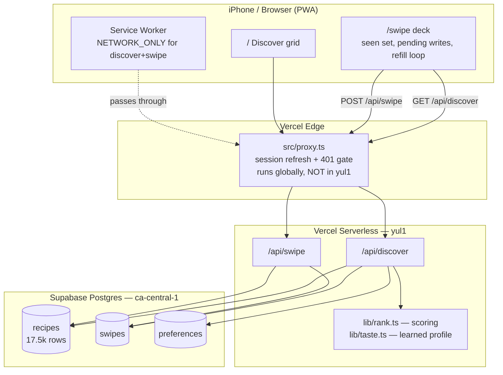
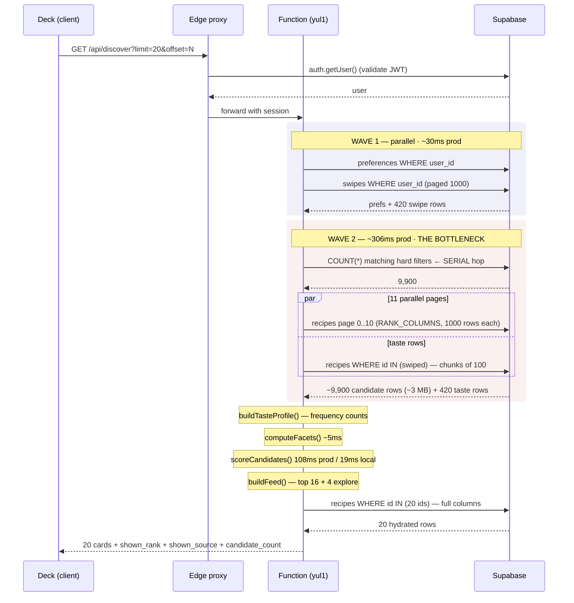
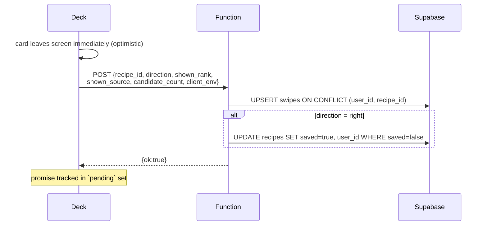
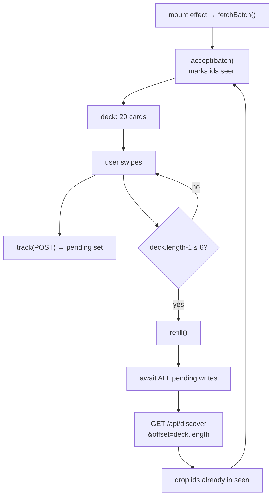

# Recipe Vault — Discover & Swipe system design

Reference for the two hot paths. Every number here is measured, not estimated;
the source of each measurement is noted inline.

- **Production:** Vercel Hobby, region `yul1`, colocated with Supabase `ca-central-1`
- **Corpus:** 17,474 shared recipe rows (`saved = false`) + 58 library rows (`saved = true`)
- **Scale:** single user, ~420 swipes recorded

---

## 1. Stack topology

**Key constraint:** the proxy runs at the *edge* (globally distributed), the
functions run in `yul1`. `x-vercel-id` reports the edge region, so it reads
`cle1` even though the function is colocated with the database. Do not use that
header to verify function region — use the `prefsAndSwipes` timing instead.

---

## 2. `GET /api/discover` — full request flow

Returns 20 ranked cards from a 17.5k corpus. **All ranking happens in JavaScript**;
Postgres does hard filtering only.

### Stage timings (production, warm — run 9 of 10)

| Stage | Prod warm | Prod cold | Local | Share |
|---|---|---|---|---|
| `prefsAndSwipes` | 30ms | 77ms | 72ms | 6% |
| `candidatesAndTaste` | **306ms** | 1120ms | 520ms | **60%** |
| `facets` | 5ms | 8ms | 5ms | 1% |
| `scoring` | 108ms | 266ms | 19ms | 21% |
| `hydrate` | 65ms | 220ms | 124ms | 13% |
| **total** | **~505–573ms** | 1587ms | ~850ms | |

Production is **faster than local** — the laptop's wifi round trip to Supabase
is ~64ms, colocated it's ~5–15ms.

---

## 3. Where the time actually goes

### Bottleneck 1 — the candidate sweep (60%)

To rank 20 cards it fetches **~9,900 rows (~3 MB)** into the function.

- `RANK_COLUMNS` = 306 B/row on the wire
- PostgREST caps **any** result at 1000 rows → 11 parallel pages
- Egress: **3.0 MB per deck load**, ~1,700 loads per 5 GB free tier

**Unmeasured serial hop inside this stage:** `loadCandidates()` issues a
`COUNT(*)` query *first*, waits for it, then fires the 11 pages in parallel.
That's one full round trip (~30ms prod) purely to learn the page count.

### Bottleneck 2 — scoring (21%)

Pure CPU, no I/O. 108ms prod vs 19ms local = **~3.7× serverless penalty**
(ordinary, not a tier wall — an earlier reading of "flat 310ms therefore
throttled" was three cold samples clustering by coincidence).

Per candidate: 3 percentile lookups (binary search over pre-sorted arrays) +
7 component objects. 9,900 × 7 = **69,300 objects allocated** to keep 140.

### Bottleneck 3 — hydrate (13%)

One `IN (20 ids)` query for full recipe rows. Already minimal.

---

## 4. `POST /api/swipe`

**DELETE (undo)** reads `direction` *before* deleting, because that decides
whether to un-save. Only corpus rows enter the deck, so a right swipe is the
only thing that could have set `saved` — un-saving is safe.

Two writes max. Not a performance concern; it matters for **ordering**.

---

## 5. The client deck loop — where the real bugs lived

### Three invariants, each learned from a production bug

1. **`await pending` before refilling.** The server decides what to serve by
   excluding swiped ids. A refill that races ahead gets the same top cards back,
   the client drops them all as seen, and only exploration survives.
   *Measured when broken: 165 cards at median rank 1,728 of 3,469 — statistically
   indistinguishable from random (exploration-only expectation: 1,745).*

2. **Only `accept()` marks cards seen — never `fetchBatch()`.** React Strict Mode
   double-invokes the mount effect on the *same instance*, so the `useRef` `seen`
   set survives. Run 1 fetched 20 cards, marked them seen, then got cancelled;
   run 2 dropped all 16 ranked cards as duplicates and the deck opened holding
   **only 4 exploration picks**. Dev-only, but dev and prod share one database.

3. **Refill passes `offset = deck.length`.** The 6 cards still in hand are
   unswiped, so the server still ranks them top and re-sends them; the client
   drops them. *Measured: exactly 4 ranked cards discarded per refill, every
   time.* Cost was a skew — 25% exploration against a designed 20%.

---

## 6. Ranking model (`lib/rank.ts`)

Hard filters (SQL + JS guard): `saved=false`, not swiped, `max_minutes`,
`diets`, `avoid_proteins` (soft = `main_protein`, strict = `protein_traces`).

Seven weighted terms, each normalized 0–1 **within the surviving candidate set**:

| Term | Weight | Basis |
|---|---|---|
| `TASTE` | 0.9 | learned from swipes, scaled by confidence |
| `PROTEIN` | 0.7 | percentile of `protein_grams` |
| `MAIN_DISH` | 0.7 | meal_types → "is this dinner" |
| `CONCEPT` | 0.6 | meal_prep, few-ingredients |
| `CALORIE` | 0.5 | inverted percentile + 250-cal meal floor |
| `CUISINE` | 0.3 | favourite match |
| `EFFORT` | 0.15 | inverted time percentile |

**Percentile, not min–max** — protein runs p90=29g, p99=56g, max=117g; a single
bad row under min–max squashed every honest recipe into the bottom third.

`buildFeed`: top 16 by score + **every 5th card** drawn from the tail with a
seedable RNG (`?seed=` makes a feed reproducible).

---

## 7. Optimizations tried and REJECTED (do not re-litigate)

| Approach | Result | Why rejected |
|---|---|---|
| Score in SQL, return top N | **1,376–1,599ms** | 3 percentile terms = 3 sorts of 10k rows. Postgres 509ms vs JS 44ms. Offset paging repeated the whole computation per call. |
| Random-sample candidates before scoring | — | Loses the top of the feed to save time a warm path already saves |
| Module-scope corpus cache | 7× warm | Serverless instances don't share it; cold is the normal case for a few-times-a-week app |
| SQL distribution pushdown + top-N cutoff | not built | Steady state landed at ~500ms; not worth two scorers |

**Standing decision:** one scorer, in TypeScript, that you can read. 500ms cold
is fine for this usage pattern.

---

## 8. Remaining optimization opportunities (ranked)

1. **Drop the `COUNT(*)` round trip** (~30ms, trivial). Fetch pages
   speculatively until one returns < 1000 rows, or cache the count per
   preference-set. One serial hop removed from the critical path.
2. **Trim `RANK_COLUMNS` further** (~19% egress). `diet_tags` is only needed for
   the `high_protein` fallback on 28% of rows.
3. **Fewer sweeps per session.** The deck refetches all 9,900 candidates on
   every refill, and **`offset` does not help** — `buildFeed` slices *after*
   scoring (rank.ts:795), so the server sweeps and scores the full set no matter
   which page you ask for. The fix is to reduce the NUMBER of sweeps (bigger
   batch) or to stop sweeping on refills (prefetched id list + a hydrate-only
   endpoint). See docs/optimizations.md.
4. **Cut allocation in scoring.** 69,300 component objects to keep 140. Notes
   are already skipped outside `?debug=true` (31ms → 19ms local, 38%).

---

## 9. Instrumentation

- `GET /api/discover?timing=true` — per-stage server timings
- `GET /api/discover?debug=true` — per-component score breakdown with prose notes
- `GET /api/discover?seed=42` — reproducible feed
- Browser console `[deck]` lines — batch returned/kept/dropped, ranked vs explore, writes in flight
- `npx tsx scripts/feed-health.ts` — explore share + median rank of ranked cards, filtered to production

`swipes` carries counterfactual columns — `shown_rank`, `shown_source`,
`candidate_count`, `client_env` — so you can ask *what the ranker served*, not
just what was chosen. Without those the 1,728-median bug was invisible.
